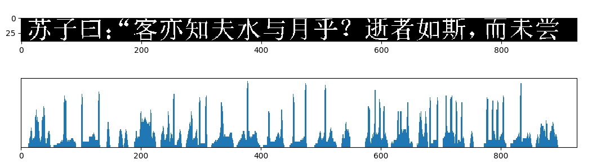
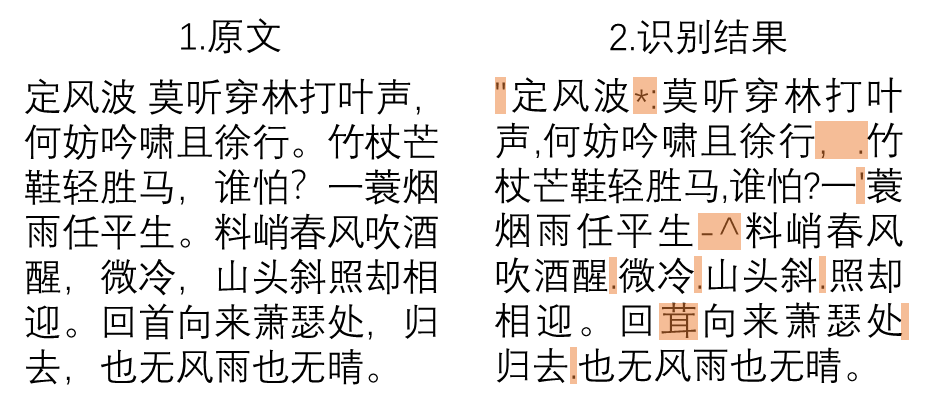

# 字符识别
尝试做到多语言的手写及打印字体识别

---

## OCR

### 数据生成

由generate_combined_char.py负责生成GB2312规定的3755个一级汉字，52个字母，10个数字，42个常用标点。共13种字体：
[('等线', 'Deng.ttf'), ('方正舒体', 'FZSTK.TTF'), ('方正姚体', 'FZYTK.TTF'), ('仿宋', 'simfang.ttf'), ('黑体', 'simhei.ttf'), ('华文行楷', 'STXINGKA.TTF'), ('华文宋体', 'STSONG.TTF'), ('华文新魏', 'STXINWEI.TTF'), ('楷体', 'simkai.ttf'), ('隶书', 'SIMLI.TTF'), ('宋体', 'simsun.ttc'), ('微软雅黑', 'msyh.ttc'), ('幼圆', 'SIMYOU.TTF')]

为每个字生成64\*64的灰度图13\*33\*2张，字体旋转限制在30度以内，其中一半随机被腐蚀或膨胀并添加椒盐噪声

为了降低IO损耗，不将每个字单独存为一张图，而是将256\*256张图片依次并入一张图，且存入磁盘前会先对所有字体图片进行shuffle，同时生成含有256*256个Label的txt文件

---

### 训练

修改的LeNet, 五层卷积，四层池化
输入64X64的灰度图
conv1->pool1->conv2->pool2->conv3->pool3->conv4->conv5->pool4->fc1->fc2

---

训练过程的准确率以及损失函数值如图11。在Tesla M40显卡运行时大约一分钟后损失函数开始收敛，共训练约两小时。
将batch_size改为128，学习率调为0.00158后较稳定，收敛更快

测试集正确率大约在98.2%左右，损失在0.06左右，下图为测试集中几个有代表性的图片识别及其前五softmax输出值

---

### 字符切分

二值化->倾斜矫正->字符切分
二值化使用OTSU算法，倾斜矫正通过霍夫变换实现，字符切分通过水平和竖直投影实现。

---
霍夫变换

水平投影

竖直投影

目前仅能切分简单背景的图片

识别结果
